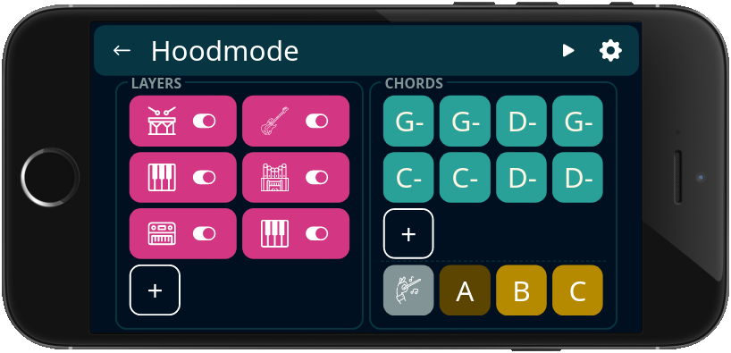

# hoodmode

Thanks for testing my app! It is a tool for musicians to play around with rhythm,
baselines and chords in a live setting.
Before you try it, check this video as an introduction.
It is an introduction bothe when it comes to what the app is and how it can be used.

  

    <iframe src="https://www.facebook.com/plugins/video.php?href=https%3A%2F%2Fwww.facebook.com%2Fli.mikael%2Fvideos%2F10157199038417339%2F" frameborder="0" allowfullscreen
      style="position:absolute;top:0;left:0;width:100%;height:100%;"></iframe>
  

# Download

The app is currently not on any app stores. Eventually it will be of course. 
I want to do a round of testing first, and I'm really grateful that you want to test it!
To download it for Android and iOS, please use the links below. 
For Android users, is should be s easy as just downloading it and testing it. For iOS users, some extra steps are required, see below. In the app there is a little info link. You can use this to check the version of the app you currently have installed on your phone.

# Notes for iOS users

Since the app is not yet released on the iOS app store, I need to set up my build process for the app so that it can be ran on your phone. In order to do this, I need the UDID of your phone. Please find the UDID of your phone and send it to me, and I will notify you when a version is ready that is enabled for your phone. You can use this site to find your UDID:

https://get.udid.io/

And here is a video explaining how to do the same:

https://www.youtube.com/watch?v=MvZGl_NVHVI
